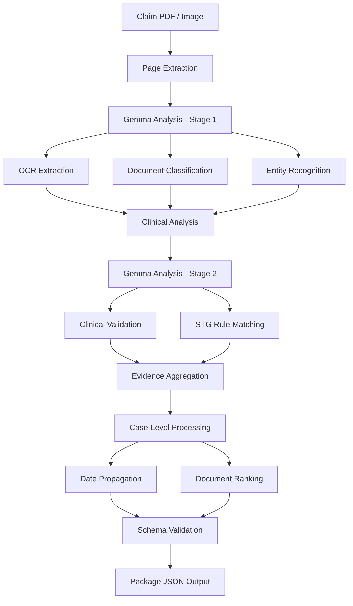

# 🏥 PM-JAY Auto-Adjudication System

### IISc Healthcare Hackathon 2026 — Problem Statement 1 (PS1)

> Leaderboard-leading solution for automated healthcare claim adjudication under the National Health Authority's Ayushman Bharat PM-JAY scheme.

[]()
[]()
[]()
[]()

---

## 📖 Overview

This repository contains our end-to-end solution for **IISc Healthcare Hackathon 2026 – PS1**, which focuses on automating the adjudication of PM-JAY healthcare insurance claims.

The system processes claim documents (PDFs and images), extracts clinical and administrative evidence, validates claims against Standard Treatment Guidelines (STGs), and generates adjudication-ready outputs conforming to NHA specifications.

The solution leverages **Gemma 3 12B Vision-Language Models**, rule-based clinical validation, and package-specific heuristics to achieve high accuracy while remaining within strict token and compute constraints.

---

## 🎯 Supported PM-JAY Packages

| Package Code | Medical Condition      |
| ------------ | ---------------------- |
| MG064A       | Severe Anemia          |
| SG039C       | Cholecystectomy        |
| MG006A       | Enteric Fever          |
| SB039A       | Total Knee Replacement |

---

# 🏆 Results

## Best Submission

| Metric          | Score      |
| --------------- | ---------- |
| Mandatory F1    | 0.9154     |
| Clinical F1     | 0.7909     |
| Extra F1        | 0.7684     |
| Rank Score      | 0.1066     |
| **Final Score** | **0.7662** |

### Package-wise Coverage

| Package | Records Generated |
| ------- | ----------------- |
| MG064A  | 351               |
| SG039C  | 331               |
| MG006A  | 456               |
| SB039A  | 459               |

---

# 🚀 Key Features

### 📄 Multi-Document Healthcare Understanding

* PDF and image processing
* Medical document classification
* OCR-based information extraction
* Clinical evidence identification
* Administrative evidence detection

### 🤖 Dual-Pass Gemma Pipeline

Every page undergoes two independent analyses:

#### Pass 1: Document Intelligence

Extracts:

* OCR text
* Document category
* Medical entities
* Administrative entities
* Visual indicators
* Evidence snippets

#### Pass 2: Clinical Assessment

Validates:

* Diagnosis evidence
* Clinical findings
* Laboratory results
* Procedure evidence
* STG compliance

### 🧠 Hybrid Clinical Validation

The highest-performing strategy combines:

```text
Keyword Evidence ∩ Gemma Clinical Prediction
```

This approach reduced false positives while maintaining strong recall across all package categories.

### ⚡ Intelligent Caching

Two cache layers minimize repeated model calls:

* Document understanding cache
* Clinical assessment cache

Result:

```text
First Run  → Full Processing
Later Runs → Near Instant Execution
```

---

# 🏗️ System Architecture



---

# 📊 Experiment Tracking

Several clinical evidence fusion approaches were evaluated.

| Experiment                            | Clinical F1 | Extra F1   | Rank Score | Final Score |
| ------------------------------------- | ----------- | ---------- | ---------- | ----------- |
| Per-page Evidence + RANK_MAP          | 0.7838      | 0.7683     | 0.1070     | 0.7641      |
| Pure Gemma Clinical Override          | 0.7567      | 0.7683     | 0.1060     | 0.7554      |
| Keyword ∩ Gemma                       | 0.7909      | 0.7683     | 0.1060     | 0.7661      |
| Hybrid Union Strategy                 | 0.7725      | 0.7683     | 0.1060     | 0.7604      |
| Keyword ∩ Gemma + SG039C Enhancements | **0.7909**  | **0.7684** | **0.1066** | **0.7662**  |

---

# 📂 Repository Structure

```bash
.
├── solution_notebook.ipynb
├── best_submission_ps1.ipynb
│
├── best_submission_outputs/
│   ├── MG064A.json
│   ├── SG039C.json
│   ├── MG006A.json
│   └── SB039A.json
│
├── STG_RULES_*.md
├── STG Rules PDF's/
│
├── nha_ps1/
├── scripts/
│   ├── build_solution_notebook.py
│   ├── test_solution_notebook.py
│   └── smoke_test.py
│
├── vlm_cache/
├── vlm_clinical_cache/
│
├── requirements.txt
└── README.md
```

---

# ⚙️ Running the Solution

## 1. Upload Notebook

Upload:

```text
solution_notebook.ipynb
```

to the NHA Jupyter platform.

---

## 2. Configure Credentials

Update:

```python
clientId = "YOUR_CLIENT_ID"
clientSecret = "YOUR_CLIENT_SECRET"
```

---

## 3. Download Databank

Databank ID:

```text
c110a5f8-6e79-43bd-bd7a-979677354958
```

---

## 4. Configure Runtime

```python
MAX_VLM_CALLS = None
```

---

## 5. Execute

Run all notebook cells.

Generated outputs:

```text
output/
├── MG064A.json
├── SG039C.json
├── MG006A.json
└── SB039A.json
```

---

# 📈 Ranking Strategy Evaluation

| Ranking Method        | Rank Score | Final Score |
| --------------------- | ---------- | ----------- |
| Per-Page RANK_MAP     | **0.1070** | **0.7641**  |
| Global Sequential     | 0.0999     | 0.7632      |
| Typical Rank Ordering | 0.0450     | 0.7557      |
| Filename Ordering     | 0.0075     | 0.7515      |

Per-page ranking based on document-specific ordering consistently performed best.

---

# 💰 Resource Efficiency

## Token Usage

| Resource      | Limit | Consumption |
| ------------- | ----- | ----------- |
| Input Tokens  | 24M   | 2.1M        |
| Output Tokens | 1.5M  | 690K        |
| Total Budget  | 25.5M | 2.8M        |

### Utilization

* Input Budget Used: **8.7%**
* Output Budget Used: **46%**
* Total Budget Used: **11%**

The solution remains highly cost-efficient while maintaining competitive performance.

---

# 🔬 Technical Highlights

* Gemma 3 12B Vision-Language Integration
* Healthcare Document Intelligence
* Clinical Evidence Extraction
* STG Rule-Based Validation
* Multi-Stage Information Fusion
* Case-Level Metadata Propagation
* Medical Document Ranking
* High-Performance Caching Layer
* Schema-Constrained JSON Generation

---

# 🌟 Future Enhancements

* Cross-document reasoning
* Temporal evidence linking
* Lab result normalization
* Explainable adjudication decisions
* Additional package support
* Lightweight fine-tuning for healthcare documents

---

# 🙌 Acknowledgements

Developed for the **IISc Healthcare Hackathon 2026** in collaboration with the **National Health Authority (NHA)**.

This project demonstrates the application of multimodal large language models and healthcare-specific validation pipelines for scalable, automated claim adjudication under the Ayushman Bharat PM-JAY program.
